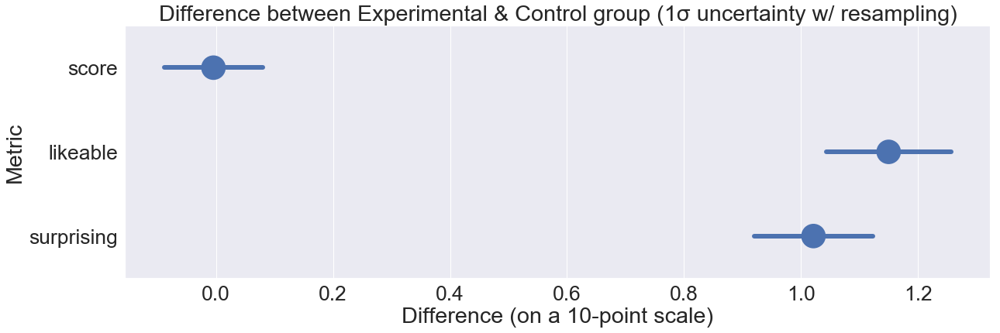

Every day, we're bombarded with statistics on economics, politics, science, etc. But too often, numbers go in one eye and out the other. So the question is:

**How do you make statistics more sticky?**

Take a wild guess on these three stats:

// interactive

This guessing game was part of [a randomized controlled web-experiment]() I did earlier this month. Inspired by New York Times' [You Draw It](), I wanted to see if, in fact, predicting an answer *before* seeing it makes it more memorable.

Here was my experimental design:

Both groups see 10 statistics about the world, in random order. Why 10? Because I wanted to overload short-term memory, which cognitive scientists have estimated can only hold 7±2 "chunks".* (Or 3±1, depending who you ask*)

Previous studies have already shown that confronting your misconceptions helps you learn better, whether that's directly[muller] or indirectly through prediction[crouch, hullman]. So, [when I "pre-registered" my experiment](), I hypothesized that "predict it first" should create a *small* increase in memory retention.

But when I analyzed data came in (N=1000+ responses), to my great surprise...

Well... what do *you* predict happened?

// interactive

That's right: *null result.*

(sad trombone)

So after performing the scientific protocol of "moping around for a few days", I embraced the null. After all, science is the world's biggest Sudoku puzzle, where we get to the right answer mostly by process of elimination.[metaphor, popper] Null results are exactly that: elimination.

And besides, this null was puzzling. People in the interactive "predict it first" group did report *liking* it more (d=0.55, p<0.001), and did report being *surprised* more (d=0.51, p<0.001)... **and yet that's *still not sufficient* for helping people *remember* more.**[animation study]

Therefore, my experiment (with its null result) must have had something different from all the previous "confront your misconceptions first" experiments (with their positive results)[crouch, huller, muller].

I think the big difference was this: **all the other studies taught & tested people on ONE topic.** Whether that's quantum mechanics, voter demographics, smartphone prices – they showed information on a single topic, and never mixed topics.

In contrast, my experiment showed *10 different stats in 10 different topics* in five minutes. I got exactly what I wished for: I overloaded short-term memory. Remember, it only holds 3±1 chunks. If "predict it first" had any effect, it would have been wiped out by the sheer cognitive load of trying to hold 10 unrelated facts in one's head.

In hindsight, that sounds like an obvious mistake, but "cram lots of ideas in a short time" *is exactly what a lot of online educational content does.* Top 10 Lists, lightning-pace YouTube videos, etc. My null result implies a hard lesson for "educational content" makers: **no matter how interesting or surprising you make your content, if you go against basic cognitive science principles, it'll all be for naught.**

I've been making "learn-by-playing" games for years. I think it'd be good for me to keep doing (admittedly amateur) cogsci experiments like this. Practice without theory can get lost down a blind alley. Theory without practice can get lost in the clouds. Maybe the two would greatly benefit by learning from each other.

That's my hypothesis, anyway.

It's time to test that.

---

Special thanks to my Patreon supporters for helping me do this experiment! (See their names & drawings here) (Help me make more games/science)

Also huge thanks to these folks for giving design/stats/science advice: [ee] [srini] [jessica hullman]

Play the experiment here: random | control | experiment

My data: raw (zip) | cleaned (csv)

My data-cleaning code: jupyter | html export

My data-analysis code: jupyter | html export

Web-experiment source code: github

---

Footnotes & References: